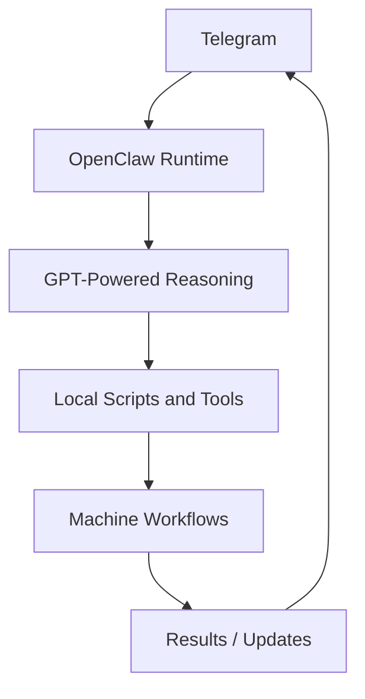

# System Diagram

## Plain-English view

1. A request comes in through Telegram.
2. OpenClaw receives and routes the request.
3. GPT-powered reasoning helps interpret the request.
4. Local scripts, tools, and workflows are used where appropriate.
5. The result is sent back through Telegram.
